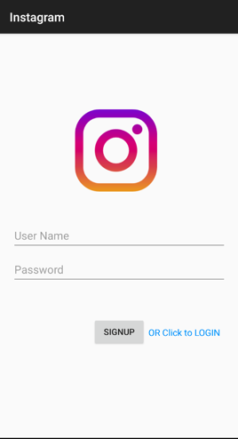
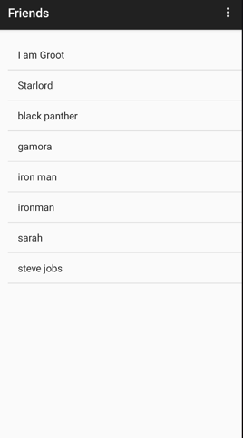
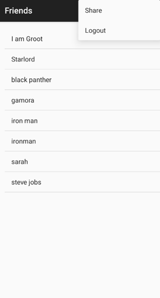
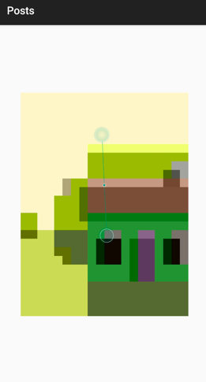

# Instagram

Instagram clone app with the Basic feature developed using Java and using AWS - bitnami parse server
1. Login/signup

2. View all the available users (friends)

3. Able to share photo

4. Ability to View the friends post and logout

